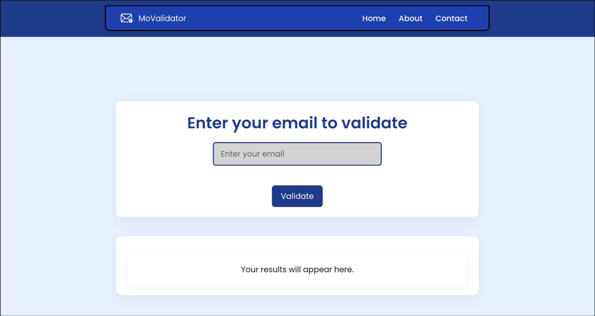

---

# 🚀 MoValidator – Advanced Email Validator

A sleek and powerful client-side email validator built using **HTML**, **CSS**, and **JavaScript**.  
**MoValidator** helps validate email addresses, detect disposable domains, and block fake signups — all right in the browser!

---

### 📦 Features

✅ Validate email address format using RegEx  
✅ Check domain validity against known TLDs  
✅ Identify disposable (burner) email addresses  
✅ Detect free email providers like Gmail, Yahoo, Outlook  
✅ Lightweight and fast – 100% frontend, no backend required  

🚨 MX record check – coming soon  
🚨 SMTP connection validation – coming soon  
🚨 Domain age & quality scoring – coming soon

---

### 🎯 Use Cases

- 🛡️ Block fake or temporary emails in signup forms  
- 📈 Improve marketing campaign performance and sender reputation  
- ✉️ Keep your email list clean and verified  
- 🔒 Prevent spam, fraud, and bot signups  
- 🔧 Easy integration with any static or dynamic frontend project  

---

### 🛠️ Built With

- **HTML5** – Clean and semantic markup  
- **CSS3** – Responsive and minimal styling  
- **JavaScript (Vanilla)** – Fast, dependency-free logic  

---

### 📸 Demo

🌐 **Live Preview**: [movalidator.netlify.app](https://movalidator.netlify.app)  
*(Hosted with ❤️ on Netlify)*

  
*A clean, responsive interface for validating emails in real-time*

---

### 🚀 Getting Started

1. Clone the repository  
```bash
git clone git@github.com:mosahel01/email-validator.git
```

2. Navigate to the project directory  
```bash
cd Code/Email-Validator/Base/
```

3. Open `index.html` in your browser  
4. Start entering email addresses to see live validation!

---

### 📂 Folder Structure

```
Code/Email-Validator/Base/
├── img
│   ├── email.svg
│   └── loading.svg
├── index.html
├── js
│   └── index.js
├── README.md
└── style
    └── nothing.css
```

---

### 🗺️ Roadmap

- [ ] MX record validation (server-side or API-based)
- [ ] SMTP ping and inbox detection
- [ ] Domain age and trust scoring
- [ ] Export/Save validation results

---

### 🤝 Contributing

Pull requests are welcome! If you have ideas, find a bug, or want to improve the validator, feel free to open an issue or submit a PR.

---

### 📄 License

Licensed under the **MIT License** — use it freely, just give credit. 💌

---

